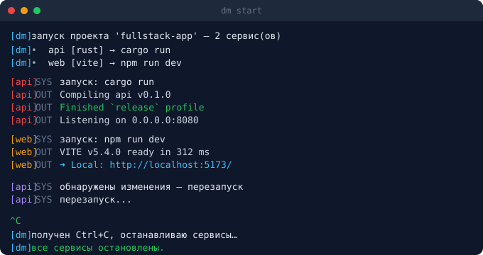
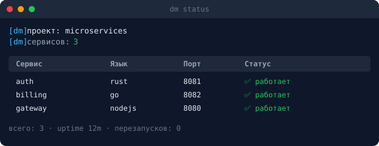

<p align="center">
  
</p>

<p align="center">
  <strong>Единый менеджер разработки: оркестрация микросервисов, git-автоматизация, анализ кода и деплой — из одной консоли.</strong>
</p>

<p align="center">
  <a href="https://github.com/Nopass0/dev_manager/actions/workflows/ci.yml"></a>
  
  
  
  
  
</p>

<p align="center">
  <a href="#быстрый-старт">🚀 Быстрый старт</a> ·
  <a href="#возможности">✨ Возможности</a> ·
  <a href="./examples/">📁 Примеры</a> ·
  <a href="#recipes--типовые-сценарии">📖 Recipes</a> ·
  <a href="./CONTRIBUTING.md">🤝 Контрибьюторам</a> ·
  <a href="./README.en.md">🇬🇧 English</a>
</p>

---

`dm` упрощает жизнь в монорепозитории (или мультрепозитории) с микросервисами:
один `dm.yaml` описывает весь проект, а `dm start` поднимает все сервисы с
горячей перезагрузкой, мультиплексирует их логи в одну консоль и следит за
изменениями кода. Git-команды, тесты, линтеры и деплой — тоже через `dm`.

<p align="center"><em>Как выглядит <code>dm start</code>:</em></p>
<p align="center">
  
</p>


---

## Возможности

- 🚀 **Оркестрация процессов** — запуск всех микросервисов с очередью (`order`)
  и задержками (`delay_ms`), гарантированное убийство всего дерева подпроцессов
  при остановке/перезапуске.
- 📜 **Единая консоль логов** — цветные префиксы `[service]`, уровни `OUT/ERR/SYS`.
- 🧬 **Гибкий конфиг** — наследование (`extends`), окружения (`dm.<env>.yaml` +
  `--env`/`DM_ENV`), интерполяция `{{var}}`/`${VAR}`, глобальные `defaults:`,
  профили и теги, `only_on:` фильтр по окружениям.
- 🔄 **Hot reload** — watcher отслеживает файлы и перезапусвает нужный сервис.
- 🔧 **Git-автоматизация** — `dm commit` (multi-repo), `dm commit auto` (сообщение
  из изменённых символов через tree-sitter), `dm git stash/branch/rebase` (cross-repo),
  conventional commits + авто-CHANGELOG.
- 🗄 **БД и Docker** — `dm db migrate/seed/reset/shell` и `dm docker up/down/logs/ps`.
- 📦 **Единый `.env`** — переменные с секциями `[service]` раскидываются по сервисам.
- 🔍 **Анализ кода** — DRY/KISS/дубликаты/unused + `dm grep/replace/refs/secrets`,
  `dm gen diagram` (Mermaid из графа импортов).
- 🔔 **Уведомления** — webhook (Slack/Telegram/Discord) + desktop о крэшах/тестах.
- 🌐 **Деплой по SSH** — цели с триггерами `manual`/`after_commit`/`after_push`.
- 🪟🐧 **Кросс-платформенность** — Windows и Linux наравне; oneliner-установка с
  автоматическим добавлением в PATH.

---

## Установка

### Windows (PowerShell)
```powershell
iwr -useb https://raw.githubusercontent.com/your-org/dev_manager/main/scripts/install.ps1 | iex
```

### Linux / macOS
```sh
curl -fsSL https://raw.githubusercontent.com/your-org/dev_manager/main/scripts/install.sh | sh
```

Оба скрипта скачивают бинарник под архитектуру вашей ОС, распаковывают его и
**добавляют каталог в PATH** (постоянно). После установки перезапустите терминал.

> ⚠️ Замените `your-org/dev_manager` на реальный путь репозитория после публикации.

### Из исходников (для разработки)
```sh
git clone https://github.com/your-org/dev_manager
cd dev_manager
cargo build --release      # бинарник: target/release/dm
cargo install --path crates/dm-cli   # установить в ~/.cargo/bin
```

**Требования для сборки:** Rust nightly 1.93 (закреплён в `rust-toolchain.toml`),
C-компилятор (MSVC Build Tools на Windows, gcc/clang на Linux) — нужен для
tree-sitter-грамматик. Системный `git` — для git-команд.

---

## Быстрый старт

```sh
# 1. В корне проекта создайте конфиг:
dm init                      # → dm.yaml из шаблона

# 2. Отредактируйте dm.yaml под свои сервисы (см. dm.example.yaml)

# 3. Bootstrap: установить зависимости + .env + поднять инфру за раз:
dm setup

# 4. Запустите все сервисы с горячей перезагрузкой:
dm start                     # Ctrl+C — корректный останов

# В другом терминале:
dm status                    # таблица статусов
dm commit "feat: новый эндпоинт"   # коммит во все репо
dm commit auto               # сообщение из изменённых символов
dm push                      # пуш каждого репо в свой origin
dm lint                      # DRY/KISS/unused/duplicates
dm test                      # тесты сервисов
```

## Готовые примеры проектов

В каталоге [`examples/`](./examples/) — три рабочих проекта с `dm.yaml`:

| Пример | Что демонстрирует |
|---|---|
| [**fullstack**](./examples/fullstack/) | Rust API + Vite-фронт + Postgres/Redis в Docker: профили, depends_on, health-checks, before_start, aliases |
| [**multi-repo**](./examples/multi-repo/) | Микросервисы в отдельных git-репозиториях: cross-repo commit/push/update |
| [**polyglot**](./examples/polyglot/) | Rust + Go + Python: наследование (`extends`), окружения (`dm.<env>.yaml`), `only_on` |

Каждый пример валидируется (`dm config validate`) и снабжён собственным README.

```

---

## Минимальный `dm.yaml`

```yaml
version: 1
project_name: my-app
env_file: .env

services:
  api:
    path: ./services/api
    language: rust
    tags: [backend]         # фильтр --tag=backend
    depends_on: [db]        # не стартует, пока db не healthy
    health:
      kind: http
      url: http://localhost:8080/health
      warmup_secs: 2
  web:
    path: ./services/web
    language: vite
    order: 20
    delay_ms: 500

profiles:
  min:
    services: [api]         # dm start --profile=min

linter:
  dr: true
  kiss: true
  unused_code: true
  duplicates: true
```

Полная схема и все опции — в [docs/ru/configuration.md](./docs/ru/configuration.md).

---

## Команды

| Команда | Описание |
|---|---|
| `dm init` / `dm new service\|route\|component\|test\|migration` | Создать конфиг / артефакты |
| `dm start` | Запуск (`--only/--skip/--tag/--profile/--affected/--dry-run/--wait`, глобальный `--env`) |
| `dm stop` / `dm restart <svc>` | Остановить / перезапустить |
| `dm status` / `dm logs [svc]` / `dm top` / `dm dashboard` | Статус, логи, live-таблицы |
| `dm build [svc] [--release]` | Унифицированная сборка |
| `dm clean [--target=all\|cache\|branches\|docker] [-y]` | Умная очистка проекта |
| `dm history` / `dm list services\|profiles\|tags\|deploy\|db` | Обзор активности и сущностей |
| `dm db migrate\|seed\|reset\|shell` | БД (postgres/sqlite/redis/mongo/mysql) |
| `dm docker up\|down\|logs\|ps` | Docker/Compose инфраструктура |
| `dm gen diagram` | Mermaid-диаграмма архитектуры |
| `dm grep <pat>` / `dm replace <old> <new>` / `dm refs <sym>` / `dm secrets` | Поиск/замена/секреты |
| `dm format` / `dm lint [svc]` | Форматирование / анализ кода |
| `dm watch [svc] -- <cmd>` / `dm hooks install` | Watcher-runner / git-хуки |
| `dm commit [target] "msg"` / `dm commit auto` / `dm push` / `dm git stash\|branch\|rebase` | Git-автоматизация |
| `dm release <patch\|minor\|major>` | SemVer-bump + авто-CHANGELOG |
| `dm test [svc]` / `dm deps audit\|outdated` | Тесты / аудит зависимостей |
| `dm doctor` / `dm config list\|get\|edit\|validate` | Диагностика / конфиг |
| `dm ping <svc>` / `dm url <svc>` / `dm open` / `dm ports` / `dm kill` / `dm exec` / `dm shell` | Проверки/процессы/команды |
| `dm deploy <name>` / `dm env sync` / `dm cache clear` | Деплой / .env / кэши |
| `dm completions <shell>` / `dm install` / `dm version` | Автодополнение / PATH / версия |

Подробно — в [docs/ru/commands.md](./docs/ru/commands.md).

---

## Архитектура

Cargo workspace из 7 crate'ов с чёткими границами:

```
crates/
├── dm-core       конфиг dm.yaml, единый .env, модель проекта, ошибки
├── dm-runtime    оркестрация процессов, kill_tree, watcher, стрим логов, notify
├── dm-cli        бинарь dm: 50+ команд, цветной вывод, shell-абстракция
├── dm-vcs        git (через CLI), commit/push multi-repo, commit auto, semver
├── dm-analysis   tree-sitter: символы, doc-комментарии, DRY/KISS/unused, graph, search
├── dm-deploy     SSH-деплой (russh, каркас)
└── dm-installer  установка в PATH (Win+Linux), oneliner-скрипты
```

Весь код документирован Rust-doc-комментариями (`///` на каждой публичной
функции/структуре, `//!` в начале модуля). Сгенерировать HTML-документацию:
```sh
cargo doc --workspace --open
```

Принципы: **DRY**, **KISS**, единая система ошибок, feature-флаги для тяжёлых
подсистем, 83 unit-теста (`cargo test --workspace`).

---

## Recipes — типовые сценарии

### Поднять проект с нуля (онбординг новичка)
```sh
dm setup          # зависимости + .env + compose за один заход
dm start          # запуск с hot-reload
```

### Добавить новый микросервис
```sh
dm new service payments --lang=go   # скаффолд + автозапись в dm.yaml
dm setup                            # поставить зависимости
dm start --only=payments            # погонять изолированно
```

### Разработка с горячей перезагрузкой
```sh
dm start          # watcher отслеживает .rs/.go/.ts и перезапусвает сервис
# изменили api/src/handlers.rs → dm сам перезапустит api
```
При 5 падениях подряд сработает auto-recovery (стоп + уведомление).

### Полный цикл git без переключения каталогов
```sh
dm update                              # git pull во всех репо
dm test                                # тесты всех сервисов
dm commit auto                         # сообщение из изменённых символов
dm push                                # пуш каждого репо в свой origin
dm release patch                       # bump версии + авто-CHANGELOG
```

### Поиск и устранение долга
```sh
dm todo              # реестр TODO/FIXME/HACK
dm lint              # DRY/KISS/unused/duplicates
dm secrets           # утёкшие ключи/токены
dm refs UserService  # все использования символа
dm clean --target=branches -y   # удалить слитые orphan-ветки
```

### Диагностика проблем
```sh
dm doctor            # версии инструментов, занятые порты
dm ports             # кто слушает 3000/3001/5173/8080/5432/6379
dm ports --free=3001  # освободить порт
dm kill :3001        # убить по порту
dm history           # что коммитили недавно
```

### Свой шорткат
```yaml
# dm.yaml
aliases:
  dbq: "dm db shell"
  re: "dm restart api"
```
```sh
dm alias dbq         # выполнит dm db shell
```

---

## Troubleshooting

| Симптом | Решение |
|---|---|
| `dm: command not found` после установки | Перезапустите терминал; проверьте PATH (`echo $PATH` / `Get-Item Env:Path`) |
| `error: missing field path` при валидации | У сервиса не задано `path:` — это единственное обязательное поле сервиса |
| Сервис не стартует | `dm doctor` (проверка инструментов), `dm logs <svc>` (вывод процесса) |
| Сервис падает циклически | Auto-recovery остановит после 5 раз; проверьте `dm logs` на причину |
| Порт занят | `dm ports` → кто занял; `dm ports --free=PORT` или `dm kill :PORT` |
| tree-sitter не собирается | Нужен C-компилятор: MSVC Build Tools (Windows) или gcc (Linux) |
| `dm commit` падает | Нужен системный `git` в PATH; все git-операции идут через него |
| `dm docker` не работает | Нужен `docker` (v2 `docker compose` или `docker-compose`) в PATH |

Подробнее — в [docs/ru/installation.md](./docs/ru/installation.md).

## Кросс-платформенность

Dev Manager работает на **Windows и Linux/macOS наравне**. Все платформенные
детали инкапсулированы:

| Операция | Windows | Linux/macOS |
|---|---|---|
| Запуск команд | `cmd /C` | `sh -c` |
| Убийство дерева процессов | Job Objects (через `kill_tree`) | process groups |
| Установка в PATH | `[Environment]::SetEnvironmentVariable` | `~/.bashrc`/`~/.zshrc` |
| Desktop-уведомления | `msg` | `notify-send` / `osascript` |
| Поиск PID по порту | `netstat -ano` | `lsof -ti :PORT` |

Единый модуль `dm-cli/src/shell.rs` скрывает различия — команды пишутся
платформо-нейтрально.

## Документация и примеры

**Документация:**
- 📖 [Начало работы](./docs/ru/getting-started.md)
- ⚙️ [Конфигурация `dm.yaml`](./docs/ru/configuration.md)
- 🎛 [Команды](./docs/ru/commands.md)
- 🌿 [Multi-repo commit/push](./docs/ru/multi-repo.md)
- 🔬 [Анализ кода](./docs/ru/code-analysis.md)
- 🗂 [Единый `.env`](./docs/ru/env-sync.md)
- 🚀 [Деплой](./docs/ru/deploy.md)
- 📥 [Установка](./docs/ru/installation.md)
- 🤝 [Контрибьюторам (CONTRIBUTING)](./CONTRIBUTING.md)

**Примеры проектов** (`examples/`):
- [fullstack](./examples/fullstack/) — Rust API + Vite + Postgres/Redis
- [multi-repo](./examples/multi-repo/) — отдельные git-репозитории
- [polyglot](./examples/polyglot/) — Rust + Go + Python с наследованием
- [go-monorepo](./examples/go-monorepo/) — Go-монорепозиторий
- [python-microservices](./examples/python-microservices/) — FastAPI + Celery

**Карточка-статус:**

<p align="center">
  
</p>

---

## Лицензия

[MIT](./LICENSE)

---

<details>
<summary><b>⭐ Если проект полезен — поставьте звезду!</b></summary>

Звёзды помогают другим разработчикам найти Dev Manager. Также приветствуются
[Issues](https://github.com/Nopass0/dev_manager/issues) с идеями и
[Pull Requests](https://github.com/Nopass0/dev_manager/pulls).
</details>

